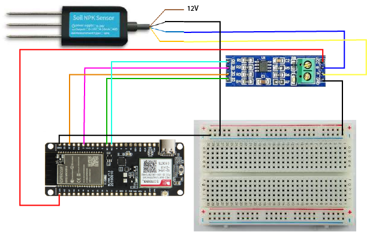

# Projet d'Electronique

## Montage
Ceci n'est qu'un montage indicatif, les broches peuvent changer lors de l'implémentation. En effet, certaines broches ne réagissaient pas.

## codeNPK
Code flashé dans l'ESP32. Il faut s'assurer d'avoir les cartes ESP32 installées sur l'IDE d'Arduino en suivant [cette procédure](https://randomnerdtutorials.com/installing-the-esp32-board-in-arduino-ide-windows-instructions/).

## Front
Frontend de l'application web réalisé en ReactJS.
* D'abord se rendre dans le dossier avec `cd Front`.
* Il faudra ensuite entrer `npm install`.
* Ensuite `npm start`.

## Culture
Modèle de prédiction du serveur.

## Back
Il s'agit du dossier du serveur réalisé avec Django. Donc, pour le lancer, il faut s'assurer d'avoir `Python` installé, `Django` également et `django-rest-framework`.

Pour le lancer :
* Se rendre dans le dossier `cd Back`. 
* Puis entrer la commande (tout en étant connecté à Internet) `py manage.py runserver 0.0.0.0:8000` car on fait une requête à une API pour avoir des données sur la température et l'humidité.